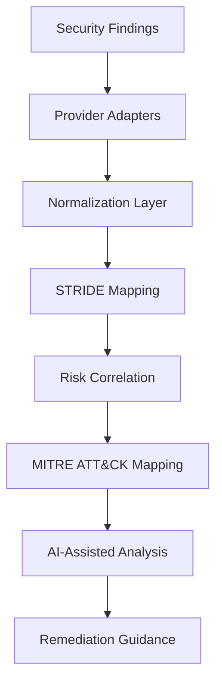

# Architecture

AI Threat Copilot is designed as an AI-assisted threat modeling and cloud security analysis platform.

The system ingests security findings from cloud providers and Kubernetes tooling, normalizes them into a common schema, maps them to threat-modeling categories, and enriches them with AI-assisted analysis.

## Components

### Provider Adapters
Convert findings from tools such as AWS Security Hub, Microsoft Defender for Cloud, Google Security Command Center, Kubescape, Trivy, and Falco into a common internal format.

### Normalization Layer
Standardizes different finding formats into one schema.

### STRIDE Mapping
Maps findings into threat-modeling categories such as spoofing, tampering, information disclosure, denial of service, and elevation of privilege.

### Risk Correlation
Groups related findings and identifies higher-risk combinations.

### MITRE ATT&CK Mapping
Maps security issues to known adversary tactics and techniques.

### AI-Assisted Analysis
Uses AI to explain risks, generate remediation guidance, and support security review workflows.

## Design Goal

This project does not replace existing scanners or security engineers. It adds a reasoning and reporting layer to help engineers understand, prioritize, and communicate cloud-native security risks.